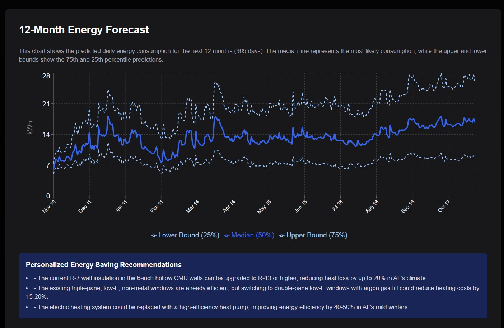

# 🌱 EcoForecast AI

## Smart Energy Forecasting for Sustainable Buildings

Predict your building's electricity consumption 12 months ahead with AI-powered accuracy and get personalized recommendations to reduce energy costs.


*Shows how much electricity your house will use*


*Input your building details for personalized forecasting*


*Personal smart AI recommendations to save electricity based on your House configurations*
---

## ✨ What It Does

- **Smart Forecasting**: 12-month electricity predictions using Chronos AI models
- **Building Intelligence**: Custom insights based on your building's characteristics  
- **Actionable Insights**: Personalized recommendations to cut energy usage
- **Interactive Dashboard**: Clean visualizations of consumption trends

[📖 Read our Blog Article](https://medium.com/@codingsimon/ecoforecast-ai-revolutionizing-energy-management-for-a-sustainable-future-4e87e3c5f94e)

---

## 🛠 Tech Stack

**Frontend**: Next.js 14, TypeScript, Tailwind CSS  
**Backend**: Python, Chronos Foundation Models, FastAPI  
**Data**: Multivariate time series, building analytics, weather integration

---

## 🚀 Quick Start

```bash
# Backend
cd backend
pip install -r requirements.txt
python app.py

# Frontend (new terminal)
cd frontend/eco-forecast
npm install
npm run dev